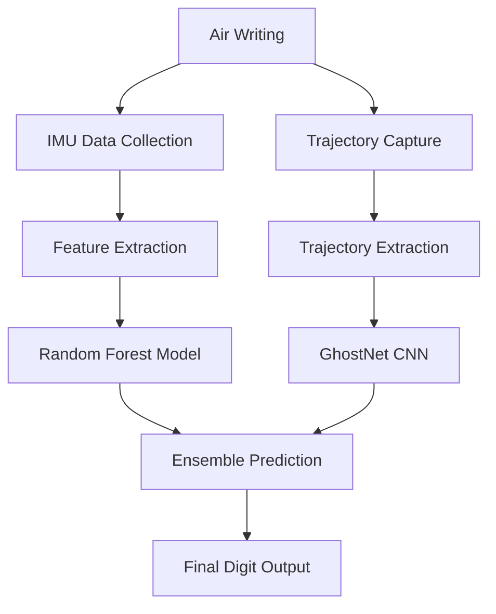
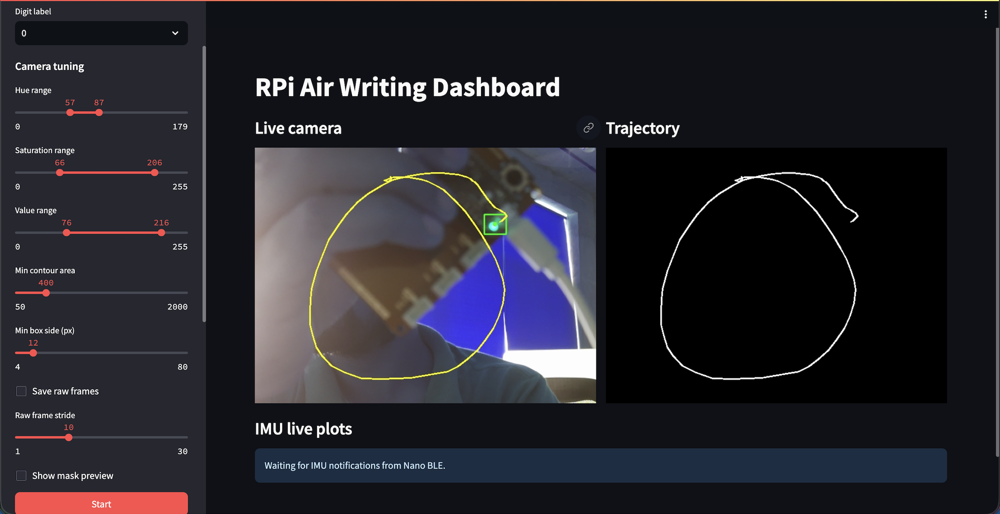
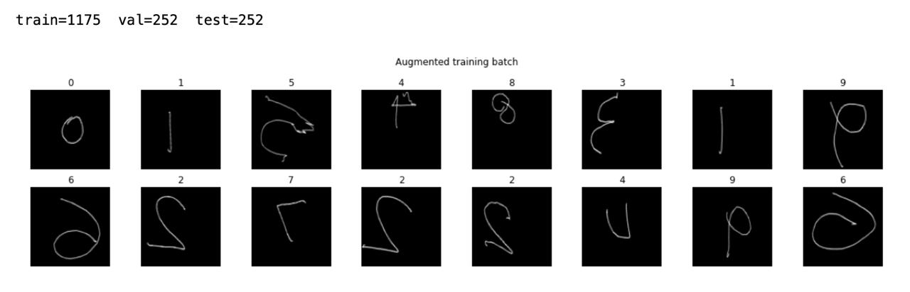
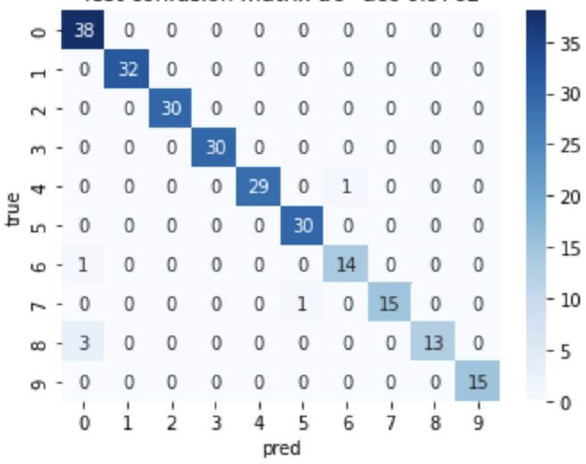
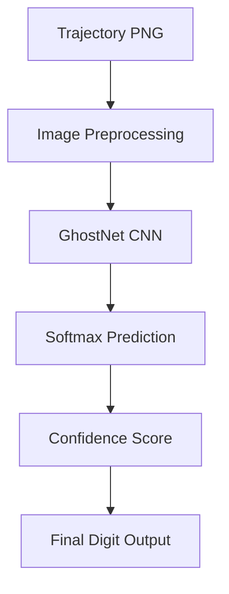
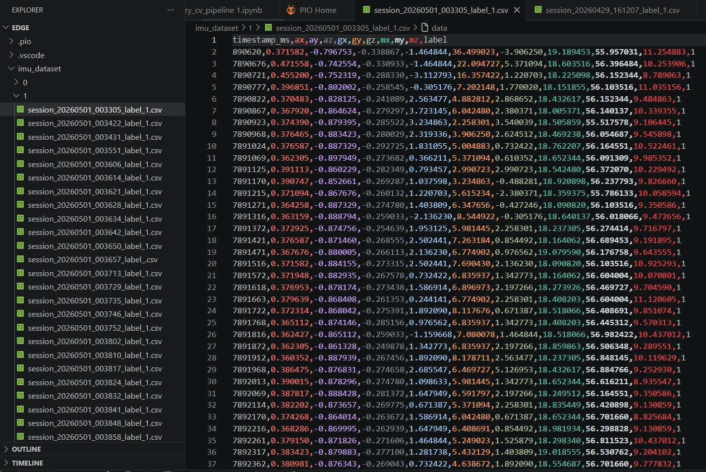
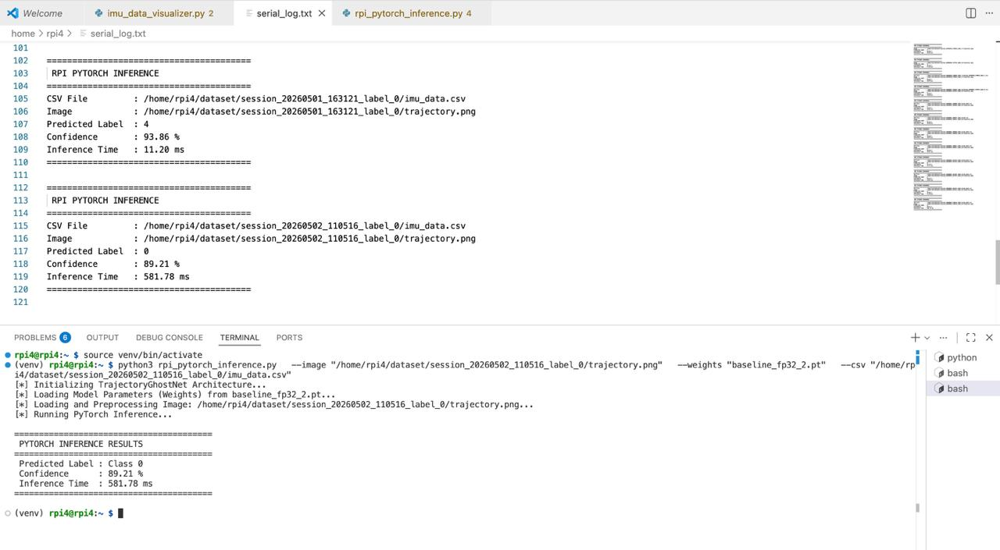

# Air-Writing Digit Recognition using IMU and Vision-Based Ensemble Learning

## 1. Problem Statement, Motivation & Objectives

Air-writing recognition is a contactless human-computer interaction technique where users write characters in free space instead of on a physical surface. However, recognizing air-written digits is difficult because of noisy motion trajectories, inconsistent writing patterns, sensor drift, and lighting variations. This project aims to develop a lightweight real-time air-writing digit recognition system using embedded edge devices.

The system combines two modalities: IMU-based motion sensing and trajectory-based computer vision. An Arduino Nano 33 BLE Sense captures accelerometer, gyroscope, and magnetometer data, while a Raspberry Pi camera tracks the trajectory of a moving light source. Both predictions are combined using ensemble learning to improve robustness and accuracy.

Edge AI was used to ensure:
- Low-latency real-time inference
- Lightweight embedded deployment
- Reduced computational cost
- Offline execution without cloud dependency

### Objectives

- Develop a real-time air-writing digit recognition system
- Collect a multimodal dataset containing IMU and trajectory data
- Train lightweight edge-deployable AI models
- Implement ensemble learning for robust prediction
- Deploy the system on Raspberry Pi and Arduino hardware

---

## 2. Overview

The proposed system uses both IMU signals and trajectory images for digit recognition. During air-writing, the Arduino Nano collects motion sensor readings while the Raspberry Pi camera tracks the motion trajectory of a green light source. IMU data is stored in CSV format and trajectory data is stored as PNG images.

The IMU data is passed through a Random Forest classifier, while the trajectory image is passed through a lightweight GhostNet-inspired CNN model. Finally, predictions from both branches are combined using ensemble learning to generate the final digit output.

### System Workflow

---

## 3. Hardware & Software Setup

### Hardware

| Component | Purpose |
|---|---|
| Raspberry Pi 4 | Vision processing and inference |
| Raspberry Pi Camera | Trajectory capture |
| Arduino Nano 33 BLE Sense | IMU data acquisition |
| LED / Light Source on Nano BLE| Air-writing marker |
| Laptop 1 | SSH access to Raspberry Pi |
| Laptop 2 | Arduino serial communication |

### Software

- Python
- Streamlit
- OpenCV
- PyTorch
- Scikit-learn
- PlatformIO IDE
- VS Code (SSH)
- micromlgen

---

## 4. Data Collection & Dataset Preparation

The dataset was collected manually because no public multimodal air-writing dataset was available for this task. More than 100 samples were collected for each digit (0–9), resulting in a dataset of over 1000 samples.

For IMU collection, the user manually entered the digit label, started recording, wrote the digit in air, and stopped recording using CTRL+C. The CSV files contained accelerometer, gyroscope, and magnetometer readings.

For vision collection, a custom Streamlit dashboard was used. The user selected the digit label, started recording, wrote the digit in air using a green light source, and stopped recording at the end. The Raspberry Pi camera tracked the trajectory and saved the final trajectory image as PNG.

Preprocessing steps included:
- HSV thresholding
- Contour extraction
- Trajectory smoothing
- Image resizing
- Grayscale conversion
- Data augmentation

### Streamlit Dashboard

Streamlit dashboard showing live trajectory visualization.

### Sample Trajectories

 Sample trajectory images collected for digits 0–9.

 Initially, attempts were made to directly integrate the Arduino Nano with the Raspberry Pi Streamlit pipeline for simultaneous sensor and vision acquisition. However, severe lag and unstable synchronization were observed during real-time operation due to the computational overhead of concurrent camera processing and serial communication. To improve stability and reduce latency, the IMU and vision data collection pipelines were separated across two systems during dataset acquisition and testing.

---

## 5. Model Design, Training & Evaluation

### IMU Model

The IMU branch used a Random Forest classifier trained on handcrafted statistical and frequency-domain features extracted from sensor data. A total of 195 features were extracted, including:
- Mean
- Standard deviation
- FFT features
- Energy features
- Correlation features
- Magnitude features

The model was trained using Scikit-learn and achieved approximately **88% accuracy**.

### Vision Model

The vision branch used a lightweight GhostNet-inspired CNN architecture with Efficient Channel Attention (ECA).

Training setup:
- Train/Validation/Test split
- Data augmentation
- Mixup augmentation
- Label smoothing
- Cosine learning rate scheduler

The vision model achieved approximately **99% accuracy**.

### Ensemble System

Predictions from both branches were combined using ensemble learning, resulting in nearly **100% prediction consistency** during testing.

### Results Table

| Model | Accuracy |
|---|---|
| IMU Random Forest | ~88% |
| Vision GhostNet | ~99% |
| Ensemble Prediction | ~100% |

### Confusion Matrix

Confusion matrix of the IMU classifier.

---

## 6. Model Compression & Efficiency Metrics

To optimize the vision model for edge deployment, Quantization-Aware Training (QAT) was used. The lightweight GhostNet architecture already reduced parameter count significantly using Ghost modules and depthwise operations.

### Optimization Techniques

- Lightweight CNN design
- Ghost convolution modules
- Efficient Channel Attention
- Quantization-Aware Training (QAT)

### Observations

- Reduced model size
- Faster inference on Raspberry Pi
- Improved edge deployment efficiency
- Minimal accuracy drop after quantization

---

## 7. Model Deployment & On-Device Performance

The IMU-based Random Forest classifier was trained using Scikit-learn and later converted into embedded C++ header files using micromlgen for deployment on the Arduino Nano 33 BLE Sense. The embedded implementation performed real-time IMU buffering, feature extraction, feature normalization, and on-device inference directly on the microcontroller.

The trajectory-based vision model was deployed on the Raspberry Pi using a custom PyTorch inference pipeline. The Raspberry Pi loaded the lightweight GhostNet-inspired CNN architecture and performed real-time inference on trajectory PNG images generated during air-writing. The inference pipeline included image preprocessing, resizing, tensor conversion, forward propagation through the CNN, softmax probability computation, confidence score generation, and inference latency measurement. The final system generated:
- Predicted digit label
- Confidence score
- Inference execution time

The deployed vision architecture used:
- Ghost modules for lightweight feature extraction
- Efficient Channel Attention (ECA)
- Global average pooling
- Dropout regularization

The system demonstrated:
- Real-time trajectory visualization
- Stable embedded inference
- Low-latency prediction
- Lightweight edge deployment

### Raspberry Pi Inference Workflow

---

## 8. System Prototype 

### IMU 

Example accelerometer, magentometer and gyroscope signals collected during air-writing.

### Prediction Example

Final prediction output generated by the ensemble system.

---

## 9. Conclusions & Limitations

The project successfully developed a multimodal air-writing digit recognition system using embedded hardware and lightweight AI models. Combining IMU sensing and trajectory-based vision significantly improved robustness and prediction accuracy.

The IMU model achieved approximately 88% accuracy, while the vision model achieved approximately 99% accuracy. Ensemble prediction further improved reliability and produced nearly perfect prediction consistency during testing.

### Limitations

- Dataset size was relatively small
- Data collection was time-consuming
- Lighting conditions affected trajectory extraction
- IMU signals were noisy and inconsistent
- Direct synchronized acquisition introduced lag

---

## 10. Future Work

Possible future improvements include:
- Alphabet and word recognition
- Continuous handwriting recognition
- BLE-based synchronized acquisition
- Mobile deployment
- Transformer-based sequence models
- Real-time sentence generation
- AR/VR integration

---

## 11. Challenges & Mitigation

| Challenge | Mitigation |
|---|---|
| Raspberry Pi lag during synchronized acquisition | Separated IMU and vision collection pipelines |
| Noisy IMU signals | Feature engineering and normalization |
| Inconsistent trajectories | Data augmentation and smoothing |
| Lighting sensitivity | HSV threshold tuning |
| Embedded deployment constraints | Lightweight models and QAT |
| Dataset inconsistencies | Repeated data collection sessions |

---

## 12. References

1. GhostNet: More Features from Cheap Operations  
2. Efficient Channel Attention (ECA-Net)  
3. PyTorch Documentation  
4. OpenCV Documentation  
5. Scikit-learn Documentation  
6. Arduino Nano 33 BLE Sense Documentation  
7. Raspberry Pi Documentation  
8. micromlgen Documentation  
9. Streamlit Documentation  